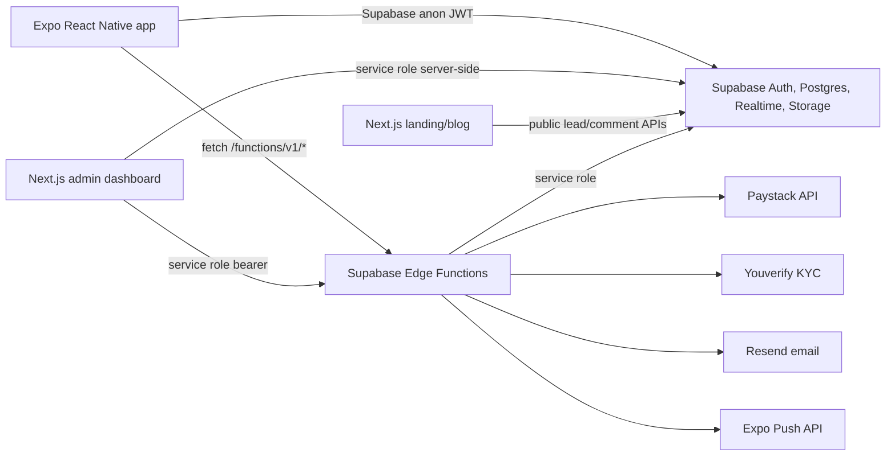
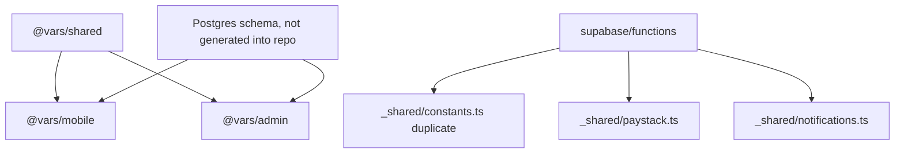
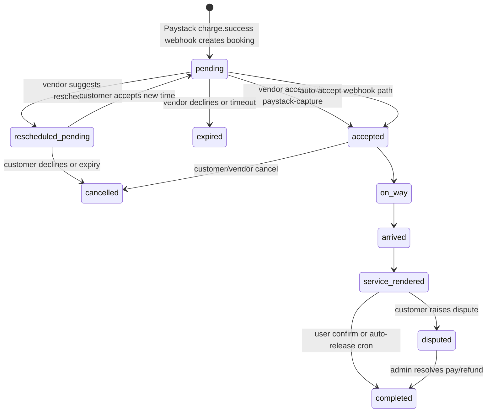
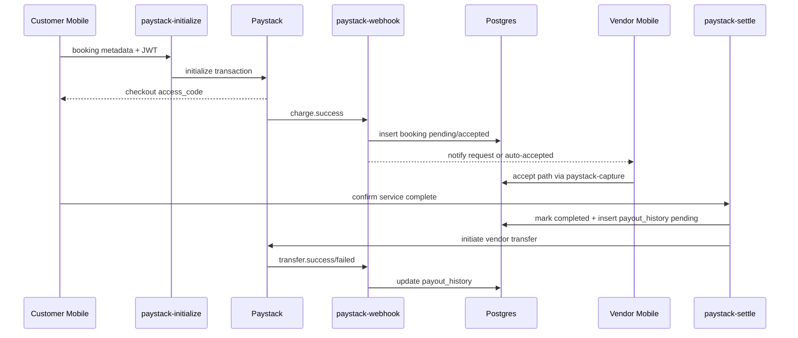
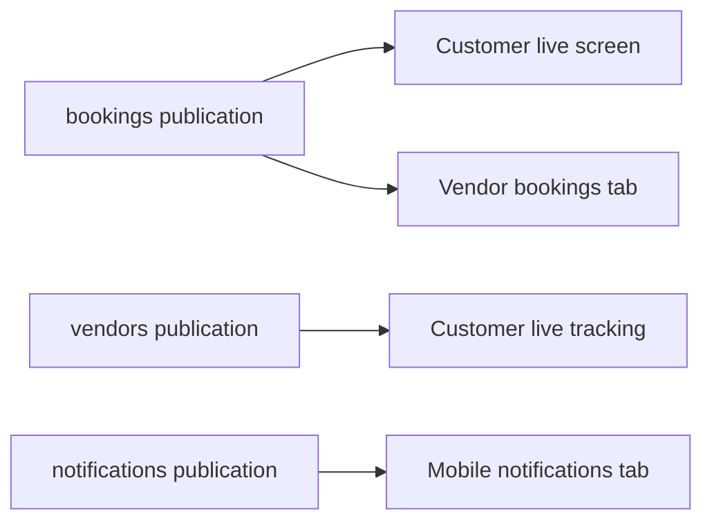
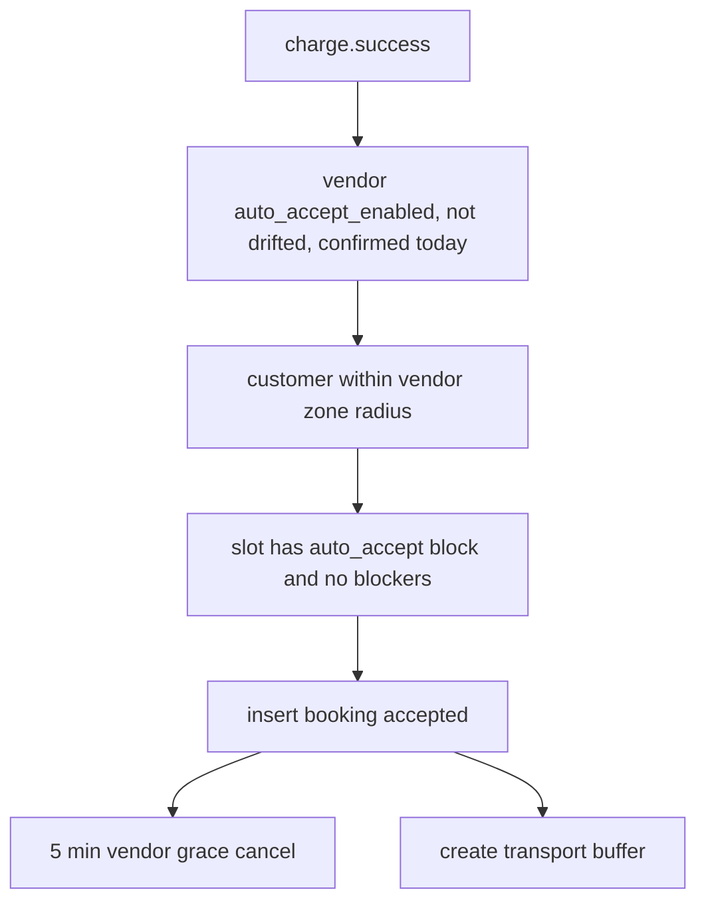
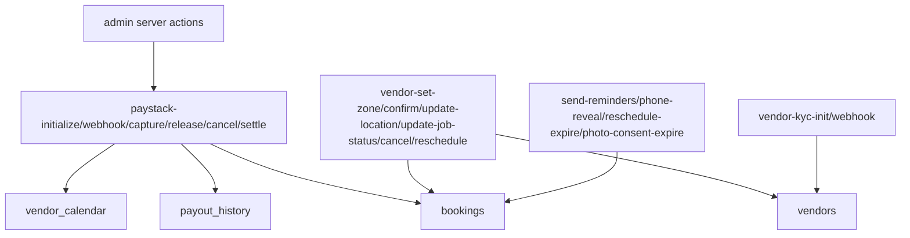

# VARS Production Architecture Audit

Date: 2026-05-25

## Runtime Architecture

## Monorepo Map

- `apps/mobile`: Expo Router app for customer/vendor auth, discovery, booking, vendor onboarding, live tracking, payment WebView, reviews, disputes, notifications.
- `apps/admin`: Next.js dashboard using server-side Supabase service role for bookings, vendors, disputes, leads, marketing.
- `apps/landing`: Next.js marketing/blog/lead capture site.
- `packages/shared`: small constants/types/format helpers. It is not a full domain model and does not contain generated DB types.
- `supabase/migrations`: schema, RLS, indexes, triggers, lead/outreach/blog migrations.
- `supabase/functions`: Edge Functions for payments, booking state changes, KYC, location, reminders, marketing, consent.

## Dependency Graph

Hidden coupling: Edge Functions and apps duplicate booking statuses, cancellation fee math, Paystack assumptions, and schedule overlap logic rather than sharing a tested state-machine package.

## Booking Lifecycle

Critical weakness: most service-role transitions are not atomic compare-and-swap updates. Two callers can observe the same prior state and both execute side effects.

## Payment Lifecycle

Finding: the code calls Paystack initialize, refund, and transfer APIs but has no immutable ledger, no reconciliation table, no webhook event table, and no enforced one-payout-per-booking unique constraint.

## Realtime Event Flow

Trust boundary issue: `vendors` is published broadly for Realtime while RLS permits public select of active vendors. Live/current location fields sit on the same table, increasing risk of unintended exposure.

## Auto-Accept Logic

Danger: auto-accept runs inside a webhook after payment success, but slot conflict checks are non-locking and there is no exclusion constraint over booking time ranges.

## Edge Function Interaction Map

## Trust Boundaries

- Mobile app is untrusted; all booking, payout, cancellation, and KYC decisions must be enforced server-side.
- Admin dashboard is high-privilege because it uses the service role and can trigger settlement/refund functions.
- Paystack and Youverify webhooks are external untrusted inputs until signatures are verified.
- Cron callers are privileged system actors guarded only by `x-vars-cron-secret`, but no cron jobs are declared in migrations.

## Central Points Of Failure

- Paystack webhook creates the canonical booking record. If webhook processing fails after Paystack takes funds, the app can navigate to bookings with no booking row.
- `bookings.status` is the main state machine and financial state indicator; there is no separate payment ledger.
- `payout_history` is mutable operational state, not an accounting ledger.
- Admin auth depends on a custom cookie and service-role queries; middleware checks only token presence.
- Cron safety depends on external scheduling that is not declared or reproducible from the repo.

## Undocumented Assumptions

- Paystack charge success means funds are already held by VARS, despite comments describing authorization/capture.
- Customers can be redirected away from Paystack and treated as paid before the booking row exists.
- Deno is available in Supabase but not locally.
- Docker/Supabase local stack is available for a new engineer, but this machine cannot run it.
- Cron jobs and secrets exist outside migrations.

