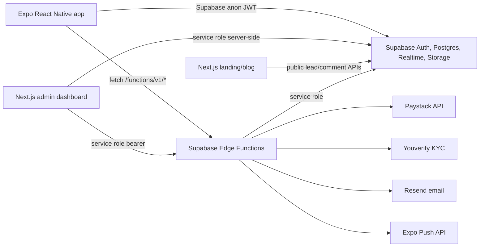
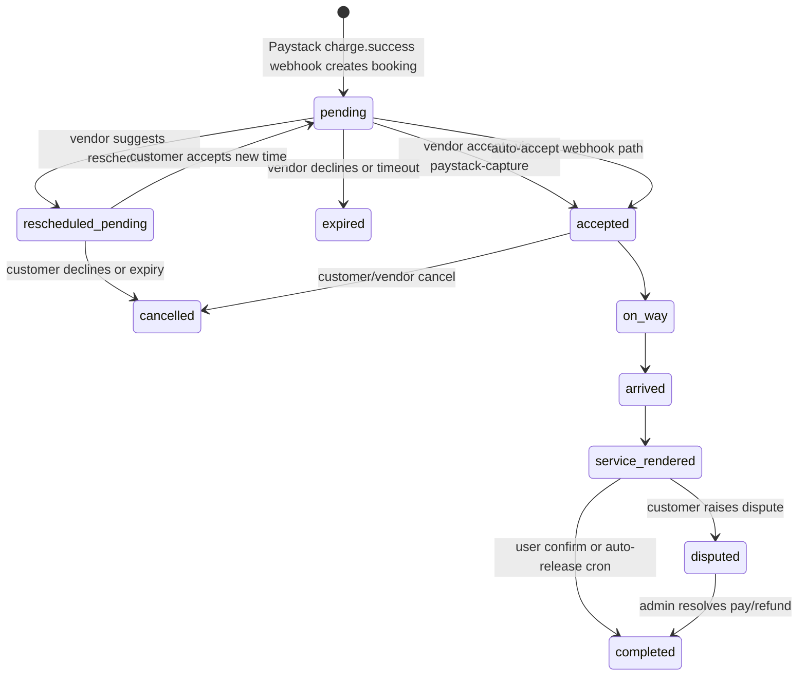
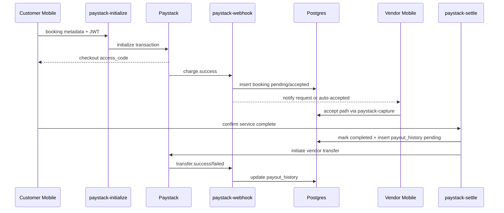

# VARS Production Readiness — Detailed Findings

Original audit date: 2026-05-25. This file consolidates the per-domain detail
behind [FINAL_REPORT.md](FINAL_REPORT.md), which stays the source of truth for
the executive summary, Top 20 blockers, remediation progress tracker, and
launch recommendation. Read that file first; come here for the exploit
scenario / fix detail behind any specific blocker.

Where a finding has since been fixed, a **Superseded** note sits directly
above it with the date, the mechanism, and the deploy/migration reference.
Anything without a Superseded note is still open.

For the mobile visual-system-era audit (accessibility, WCAG, primitive
catalogue), see [mobile.md](mobile.md) — unrelated to the findings below.

---

## Architecture

Monorepo: `apps/mobile` (Expo Router — customer/vendor auth, discovery,
booking, onboarding, live tracking, payment WebView, reviews, disputes),
`apps/admin` (Next.js, service-role dashboard for bookings/vendors/disputes),
`apps/landing` (marketing/blog/leads), `packages/shared` (constants/types
only — no generated DB types), `supabase/migrations`, `supabase/functions`.

Hidden coupling: Edge Functions and apps duplicate booking statuses,
cancellation fee math, Paystack assumptions, and schedule overlap logic
rather than sharing a tested state-machine package.

### Booking lifecycle

Critical weakness: most service-role transitions are not atomic
compare-and-swap updates. Two callers can observe the same prior state and
both execute side effects.

### Payment lifecycle

The code calls Paystack initialize, refund, and transfer APIs but has no
immutable ledger, no reconciliation table, and no enforced
one-payout-per-booking unique constraint (see [Database](#database) —
fixed via migration `20260525160000`, see Payments superseded note).

### Trust boundaries

- Mobile app is untrusted; all booking, payout, cancellation, and KYC
  decisions must be enforced server-side.
- Admin dashboard is high-privilege — service role, can trigger
  settlement/refund functions.
- Paystack and Youverify webhooks are external untrusted inputs until
  signatures are verified.
- Cron callers are privileged system actors guarded only by
  `x-vars-cron-secret`, but no cron jobs are declared in migrations.
- `vendors` is published broadly for Realtime while RLS permits public
  select of active vendors; live/current location fields sit on the same
  table, increasing risk of unintended exposure.

### Central points of failure

- Paystack webhook creates the canonical booking record. If webhook
  processing fails after Paystack takes funds, the app can navigate to
  bookings with no booking row.
- `bookings.status` is the main state machine *and* financial state
  indicator; there is no separate payment ledger.
- `payout_history` is mutable operational state, not an accounting ledger.
- Admin auth depends on a custom cookie and service-role queries.
- Cron safety depends on external scheduling not declared or reproducible
  from the repo.

### Undocumented assumptions

- Paystack charge success means funds are already held by VARS, despite
  comments describing authorization/capture.
- Customers can be redirected away from Paystack and treated as paid
  before the booking row exists.
- Docker/Supabase local stack availability is assumed but not guaranteed
  reproducible on a new machine.
- Cron jobs and secrets exist outside migrations.

---

## Database

Useful early schema work, RLS coverage, and indexes, but (at audit time)
lacked enforceable financial invariants, migration replay guarantees,
atomic booking transitions, cron declarations, and immutable audit tables.

### P0: Fresh migrations likely fail at migration 014

`20240101000014_reschedule_pending.sql` references `booking_status`, but the
enum is `booking_status_enum`. Migration 018 fixes the value later, but a
fresh reset stops at 014 first. **Fix:** correct migration 014 or squash
migrations after validating on a clean database.

### P0: No cron jobs are declared

No migration contains `cron.schedule`, `pg_cron`, `pg_net`, or
`net.http_post`, yet `paystack-release`, `paystack-settle`,
`send-reminders`, `phone-reveal`, `reschedule-expire`, and
`photo-consent-expire` all depend on cron. Bookings can remain pending
forever, phone numbers may never reveal, auto-release may never settle.
**Fix:** idempotent migrations for required extensions, Vault secrets, and
cron schedules, plus a live verification query in CI/deploy checks.

### P0: Booking overlap prevention is non-atomic

Overlap checks happen via SELECT in `paystack-initialize` and webhook code.
No range/exclusion constraint on `(vendor_id, scheduled_at, duration)`, no
transaction lock. Two customers can pay for overlapping slots under webhook
delay/retry. **Fix:** `tstzrange` column plus GiST exclusion constraint for
active statuses.

### P0: Payout integrity is not enforced

`payout_history.booking_id` is indexed but was not unique; existing-payout
check and insert were not atomic. Concurrent user-confirm, auto-release,
and admin dispute resolution could double-initiate vendor transfers.
**Fix:** `UNIQUE (booking_id)` + one SQL RPC with row lock and idempotency
key.

### P0: RLS allows direct customer/vendor booking mutation

A trigger limits status changes for JWT clients, but non-status fields
(price snapshots, Paystack references, timestamps, cancellation fields,
access details) were not protected. **Fix:** remove broad update policies;
expose narrowly scoped RPCs/Edge Functions with column-level validation.

### P1: Realtime publication includes sensitive tables

`bookings`, `vendors`, `notifications` are in `supabase_realtime`; `vendors`
carries live/current location and bank metadata on the same table. **Fix:**
split public vendor profile from private/operational state, or publish only
dedicated safe views.

### P1: `get_nearby_vendors` is `SECURITY DEFINER` and bypasses intent

Returns verified nearby vendors without requiring `is_active = TRUE` or
`is_suspended = FALSE`, despite the direct table RLS policy doing so.
**Fix:** add active/suspended filters inside the RPC; test against
rejected/suspended vendors.

### P1: Financial state is overloaded into `bookings.status`

No ledger table for authorization, refund requested/processed, transfer
initiated/success/failed, dispute hold, chargeback, or reconciliation
status. **Fix:** add immutable `payment_events`, `ledger_entries`,
`webhook_events` tables.

### P1: Admin audit trail is missing

Admin actions update vendors and disputes directly with no admin action
history. **Fix:** add `admin_audit_log` with actor, action, target, prior
state, new state, request id, timestamp.

### P1: Cancellation flag count is incorrect

`vendor-cancel-booking` updates the booking to cancelled, then counts
matching cancelled bookings, then adds `+1` — the just-updated row is
already in the count. **Fix:** remove `+1` and count after update, or count
before update and add exactly once in a transaction.

### Index/query and coupling notes

Booking overlap queries use timestamp comparisons that assume uniform
duration windows rather than a range index. `get_nearby_vendors` uses a
GiST index on `base_location` (good), but category aggregation joins can
get expensive without selective indexes. Supabase service role is the de
facto backend authority — acceptable only if every privileged path is
atomic and audited, which at audit time it was not.

---

## Edge Functions

> **Superseded (2026-07-16 — edge function hardening pass):**
> - **`paystack-release`** — admin dispute path now calls
>   `refundTransaction()` before updating booking state; returns 502 on
>   refund failure so the dispute stays open. Deployed v32.
> - **`paystack-webhook`** — now returns non-2xx for retryable internal
>   failures instead of catching-and-swallowing with a blanket 200.
> - **`vendor-kyc-webhook`** — invalid HMAC signatures now return 401
>   instead of 200.
> - **`dispute-raise`** — rollback on dispute insert failure now also
>   clears `settlement_on_hold` on the vendor if no other open/under-review
>   disputes remain (mirrors the resolve paths in `paystack-settle` and
>   `paystack-release`). Deployed v26.
> - **`paystack-gate`** — `openRetryWindow` now wraps `initializeTransaction`
>   in try/catch; on failure sets `gate_retry_expires_at = now` before
>   returning 502 so cron sweep 2 can cancel the stuck booking. Deployed v10.

The recurring pattern found at audit time: read current state, update DB,
call external API, log failures. Not transactionally safe, no idempotent
recovery.

| Function | Severity | Finding | Fix |
|---|---|---|---|
| `paystack-initialize` | Critical | Initializes Paystack before a booking row exists; slot conflict check non-atomic; no server-side idempotency key. Customer can pay, webhook can fail, no booking exists. | Create a `payment_intents` row before Paystack init with a unique idempotency key; create booking from that row under lock. |
| `paystack-webhook` | Critical | HMAC validation exists; `charge.success` idempotency check-then-insert is not atomic; auto-accept/transport-buffer side effects happen outside a transaction; webhook events not persisted. | Store every webhook event with a unique Paystack event/reference key; process via idempotent jobs. |
| `paystack-capture` | High | Accept update reads `pending` then updates by `id` only (not compare-and-swap); transport buffer creation can fail independently; `payment_captured = true` set without an actual Paystack capture call. | Update with `.eq('status', 'pending')`, verify one row changed; model payment terms accurately. |
| `paystack-settle` | Critical | Marks booking completed before transfer succeeds; inserts payout before transfer with no unique `booking_id`; admin mode accepts raw service-role bearer as authorization. | Single DB RPC that locks booking and creates one payout request; complete booking only after transfer initiation is durable. |
| `paystack-release` | Critical | Used for vendor decline/timeout/admin dispute refund; updated booking expired/completed before refund succeeded; refund failure was logged and swallowed. | Separate refund state from booking state; require refund event reconciliation before final closure. |
| `paystack-cancel` | Critical | User cancellation updates booking first, then attempts refund/vendor transfer; vendor cancellation share transfer has no payout record or idempotency key — a retry can duplicate it. | Create cancellation ledger entries with unique references before external calls. |
| `paystack-verify-bank` | High | Needs rate limiting/anti-enumeration for account lookup; bank code not stored, complicating later verification. | Persist bank code, verification reference, recipient creation response; throttle attempts. |
| `vendor-cancel-booking` | High | Updates status before refund; cancellation count double-counts the current cancellation; no idempotency. | Conditional update by prior status, cancellation event table, refund idempotency reference. |
| `vendor-cancel-grace` | High | Correctly restricts to auto-accepted bookings inside grace window, but still updates booking before refund succeeds; no refund idempotency event. | Same refund ledger pattern as above. |
| `dispute-raise` | High | Should freeze settlement before/atomically with dispute insert; needs one-open-dispute-per-booking uniqueness. | Unique partial index on open disputes; row-lock booking during dispute transition. |
| `vendor-kyc-init` | High | Hardcoded Youverify URL instead of `YOUVERIFY_BASE_URL`; doesn't fail fast if `YOUVERIFY_API_KEY` is empty. | Validate env at boot/request; externalize base URL. |
| `vendor-kyc-webhook` | Critical | No replay/idempotency table; successful KYC immediately sets `is_active = true`, bypassing manual admin review. | Store webhook event ids; separate KYC verified from admin approved. |
| `vendor-register-lead` | Medium | Uses RPC for atomic pioneer lead registration, but migration syntax needs DB validation; email/lead outreach side effects are best-effort. | Validate migration replay; add lead event audit. |
| `vendor-set-zone` / `vendor-confirm-zone` / `vendor-update-location` | High | Location accepts client-provided coordinates with no spoofing mitigation; auto-accept drift protection depends on the same untrusted client. | Treat geolocation as advisory; add fraud signals; don't use as sole safety gate. |
| `send-reminders` / `phone-reveal` / `reschedule-expire` / `photo-consent-expire` | High | Cron-secret guarded, but no cron declarations in migrations; notification idempotency is partial. | Declare jobs in migrations; add unique notification/event keys. |

### Simulation results (static trace)

- Duplicate Paystack `charge.success`: likely skipped by existing
  reference, but race can still double-insert without DB-level uniqueness
  beyond `paystack_reference` unique.
- Duplicate settlement: could double-transfer because the existing-payout
  check and insert were not atomic and `payout_history.booking_id` was not
  unique.
- Delayed refund failure: booking already cancelled/expired/completed — no
  customer-visible unresolved refund state.
- Network failure after DB update: state advances even though external
  money movement failed.
- Cron retry: can repeat side effects where notification/payout uniqueness
  is absent.

---

## Payments

> **Superseded (2026-06-24 — subaccount migration):** Financial-risk items 1,
> 2, 10 below are addressed: `payout_history.booking_id` is now unique
> (migration `20260525160000`); settlement is now `settlement_queued`
> status (no Transfer race); Pioneer counter increments at booking
> completion, not at transfer. The Escrow/Settlement Correctness sections
> below describe the old Transfer-based model, since replaced by a
> Paystack subaccount split at charge time. Items 3–9, reconciliation, and
> audit trail remain unchanged.
>
> **Superseded (2026-07-16 — dispute refund ordering fix):** Item 6 (admin
> dispute refund marks booking completed without guaranteeing refund
> success) is addressed: `paystack-release` admin path now calls
> `paystack.refundTransaction()` before updating booking state; on refund
> failure it returns 502 so `DisputeActions.tsx` does not call
> `updateDispute` and the dispute remains open for manual retry. Deployed
> as `paystack-release` v32.

### Top financial risks (at audit time)

1. Double vendor payouts possible — `payout_history.booking_id` not unique,
   settlement not atomic. *(fixed, see above)*
2. Bookings marked completed before Paystack transfer success. *(fixed, see
   above)*
3. Cancellations mark bookings cancelled before refund success.
4. Paystack webhook handler returned 200 even after internal processing
   errors. *(fixed — see Edge Functions superseded note)*
5. No immutable ledger or webhook event store.
6. Admin dispute refund marked booking completed without guaranteeing
   refund success. *(fixed, see above)*
7. Customer payment can succeed before a booking row exists.
8. Cancellation vendor-share transfers have no payout record or
   idempotency reference.
9. Paystack refund processed/failed webhooks are only logged, not
   reconciled to bookings.
10. Pioneer payout override incremented counter after transfer initiation,
    not transactionally with the payout. *(fixed, see above)*

### Escrow / settlement / refund correctness

Code comments use "authorization/capture/escrow" language, but Paystack
`charge.success` means money is charged into VARS immediately — 
`paystack-capture` never calls a Paystack capture endpoint, it just marks
the booking accepted. The product/accounting model should be described as
"VARS holds charged funds until settlement/refund," not escrow.

Refund paths in `paystack-release`, `paystack-cancel`,
`vendor-cancel-booking`, `vendor-cancel-grace`, `customer-decline-reschedule`,
and `reschedule-expire` update booking state first and (at audit time)
swallowed refund failures. Required fix: a refund request table with
`booking_id`, `reason`, `amount_kobo`, Paystack refund id/reference,
status, retry count, and customer-visible pending/failed status.

### Reconciliation & audit trail (open)

- `payout_history` exists but is mutable and vendor-transfer focused.
- Refunds are not stored as first-class rows.
- Paystack webhooks are not persisted.
- No daily balance/reconciliation job, no accounting export.
- No admin action log, no idempotency keys, no external API
  request/response correlation ids, no manual adjustment workflow.

**Launch gate:** do not process real customer payments until ledger,
idempotency, unique constraints, reconciliation, and refund/payout recovery
workflows exist and are tested under duplicate-webhook and
concurrent-settlement scenarios.

---

## Security

> **Superseded (2026-07-16 — security hardening pass):**
> - **P0: Broad Booking Update RLS** — fixed. `bookings_user_update` and
>   `bookings_vendor_update` RLS policies now have column-level
>   `WITH CHECK` correlated-subquery guards preventing JWT clients from
>   writing financial columns (`transport_fee_kobo`, `distance_km`,
>   `pre_transport_buffer_slots`). Migration `20260531000002_transport_surcharge`.
> - **P0: Admin Page Authorization Bypass Risk** — fixed. `requireAdmin()`
>   added to all admin Server Actions and page-level data fetches; verifies
>   session UID exists in `admin_users` before any service-role query.
> - **P0: Webhook Error Handling Suppresses Retries** — fixed.
>   `paystack-webhook` now returns non-2xx (502/500) for retryable internal
>   failures instead of a blanket 200.
> - **P1: Youverify Invalid Signature Returns 200** — fixed.
>   `vendor-kyc-webhook` now returns 401 for invalid HMAC signatures.

Good primitives at audit time: Supabase Auth, RLS, Paystack HMAC
validation, Youverify HMAC validation, native SecureStore. Access control,
service-role usage, webhook replay safety, cron protection, and financial
state integrity were not yet hardened.

| Finding | Severity | Exploit scenario | Blast radius | Status |
|---|---|---|---|---|
| Admin Page Authorization Bypass | P0 | Attacker sets any valid Supabase user token as `sb-access-token`; middleware allows access, pages query with service role. | Bookings, vendors, disputes, alerts, leads. | **Fixed**, see above |
| Broad Booking Update RLS | P0 | Authenticated customer/vendor uses Supabase client directly to update non-status booking columns. | Payment refs, cancellation fields, timestamps, financial snapshots. | **Fixed**, see above |
| Webhook Error Handling Suppresses Retries | P0 | Transient DB failure during Paystack webhook returns 200; Paystack doesn't retry. | Paid transactions without bookings; unreconciled transfer/refund events. | **Fixed**, see above |
| Double-Payout Race | P0 | Customer confirmation and auto-release/admin settlement race; both pass existing-payout check. | Duplicate vendor transfers. | Open (see Database → Payout integrity) |
| Youverify Invalid Signature Returns 200 | P1 | Attacker probes webhook; invalid signatures quietly acknowledged. | Reduced detection of misconfiguration/attacks. | **Fixed**, see above |
| KYC Verification Auto-Activates Vendors | P1 | Any vendor passing external KYC becomes active with no internal trust review. | Unsafe vendors enter marketplace. | Open |
| Cron Secret Undeployed / Single-Factor | P1 | Leaked cron secret lets an attacker trigger cron endpoints. | Expiries, refunds, reminders, phone reveal, settlements. | Open |
| Vendor Location Spoofing | P1 | Vendor submits fake lat/lng to avoid drift pause or appear en route. | Customer safety, auto-accept accuracy, disputes. | Open |
| Service Role Bearer Used As Admin Function Auth | P1 | Service role key exposure grants direct admin settlement/refund mode. | Full backend compromise. | Open |
| Local Env Contains Real-Looking Supabase JWTs | P2 | Local env files ignored but present on disk; accidental leak via screen share/logging/commit. | Depends on whether keys are active. | Open — rotate any real-looking local keys |

Secret handling: `.gitignore` excludes env files; no tracked env files
found for `.env.local` variants. Still, production secrets should not live
in a developer worktree when not actively needed.

---

## Admin panel

`corepack yarn workspace @vars/admin build` passed at audit time; `next
lint` was not configured and prompted interactively.

- **P0 — middleware checks only token presence:** `apps/admin/src/middleware.ts`
  allowed any request with an `sb-access-token` cookie; several server pages
  used service-role `adminClient()` without `requireAdmin()`. *(Fixed — see
  Security → Admin Page Authorization Bypass.)*
- **P0 — admin actions can trigger money movement without an audit log:**
  dispute actions call `paystack-release`/`paystack-settle` with service
  role bearer; no admin action log captures actor, rationale, before/after
  state, or external result. Open — all admin payment decisions need
  immutable audit + ledger records before external calls.
- **P1 — `updateVendor(vendorId, patch)` accepts arbitrary patch records**
  from the client component. Fix: whitelist fields, validate transitions.
- **P1 — `updateDispute(disputeId, patch)` accepts arbitrary patch records**;
  resolution and payment calls are separate operations, so a dispute can be
  marked resolved even if settlement/refund fails. Fix: one server action
  per allowed transition, transactional audit, function result persisted.
- **P1 — no reversibility or two-person control:** refund/pay-vendor
  actions are single-click and irreversible. Fix: confirmation, reason
  codes, optional dual approval for high-value disputes.

Service role key is used server-side only (directionally correct); the
failure was service-role reads occurring on pages that relied on
middleware token presence rather than admin authorization.

---

## Environment & bootstrap

Not reproducible end-to-end for a new engineer at audit time: web builds
and mobile TypeScript passed, but local Supabase, migrations, Deno function
validation, linting, and financial/KYC flows did not.

- **P0 — local Supabase cannot start or reset:** Docker not installed/on
  PATH; `FACEBOOK_CLIENT_ID/SECRET`, `GOOGLE_CLIENT_ID/SECRET` unset. Fix:
  document Docker Desktop setup + OAuth placeholders in one bootstrap
  script; CI should run migrations in a clean container.
- **P0 — migrations likely not replayable:** same root cause as
  Database → *Fresh migrations likely fail at migration 014*.
- **P1 — required financial/KYC env missing locally:** root
  `SUPABASE_URL`/`SUPABASE_ANON_KEY`, `PAYSTACK_SECRET_KEY`/`PUBLIC_KEY`/
  `VARS_RECIPIENT_CODE`, `YOUVERIFY_API_KEY`/`BASE_URL`,
  `GOOGLE_MAPS_API_KEY` all missing. Fix: `.env.example` parity per app.
- **P1 — Node version outside declared baseline:** observed Node v24.14.1
  against a declared `>=18.0.0`; Expo SDK 52 / Next 14 are typically
  validated against current LTS. Fix: pin `.nvmrc`.
- **P1 — linting not reproducible:** mobile lint crashed on Windows
  resolver traversal (`EPERM` in `eslint-plugin-import`); admin/landing
  lint invoked an interactive Next.js setup prompt. Fix: committed ESLint
  configs for all apps, non-interactive in CI. *(Note: not reproduced in
  the 2026-07 mobile visual-system session — lint ran clean multiple
  times; may be resolved or environment-specific.)*
- **P2 — Supabase CLI drift:** local `2.84.2` vs `2.101.0` available.

---

## Testing & QA

Testing was effectively absent for the critical marketplace system at
audit time. No meaningful test/spec files or test scripts existed for Edge
Functions, migrations, RLS, booking state machine, payment/refund/payout
flows, mobile screens, admin actions, Realtime behavior, or race
conditions. `yarn.lock` contains Jest transitive dependencies, but no test
harness was configured at the workspace level.

**Untested critical flows:** Paystack `charge.success` duplicate/delayed
delivery, paid transaction with booking-insert failure, vendor-accept race,
customer-cancel-during-vendor-accept race, user-confirm-vs-auto-release
race, admin-dispute-refund-vs-auto-release race, subaccount split failure
at charge time, refund failure after cancellation, Youverify webhook replay
and invalid signature, booking overlap under concurrent customers, RLS
attempts to mutate protected columns, Realtime reconnect/stale state,
offline payment/status actions.

**Required QA gates before launch:** migration replay test from empty DB,
SQL tests for RLS/constraints, Edge Function integration tests with mocked
Paystack/Youverify, race tests for booking/settlement/refund/dispute
transitions, mobile E2E happy + failure paths, admin E2E for disputes with
audit assertions, payment reconciliation tests against Paystack test mode.

Regression likelihood was assessed as **high** — behavior depended on
untested cross-service ordering and duplicated business logic.

---

## Operations & production readiness

Scorecard at audit time:

| Domain | Score | Notes |
|---|---:|---|
| Reliability | 2/10 | Non-atomic state changes, missing cron declarations, limited retries. |
| Security | 3/10 | RLS exists, but admin auth and broad update policies were unsafe. |
| Financial integrity | 1/10 | No ledger, no atomic payouts/refunds, no reconciliation. |
| Scalability | 4/10 | Basic indexes exist; Realtime and booking queries need hardening. |
| Observability | 2/10 | Console logs and a partial cron table only. |
| Maintainability | 4/10 | Clear monorepo, but duplicated business logic and no tests. |
| Operational readiness | 1/10 | No runbooks, no alerting, no recovery workflows. |

- **Observability:** mostly `console.log`/`console.error`, in-app
  notifications, and a `system_alerts` table for cron failures — no
  Sentry, tracing, structured logs, metrics, or alert routing.
- **Cron monitoring:** `system_alerts` exists but no cron jobs are
  declared (see Database).
- **Payment monitoring:** no ledger, reconciliation job, payout/refund
  dashboard, or webhook event archive (see Payments).
- **Rollback/migration safety:** fresh DB reset could not be run locally;
  static review found a likely replay blocker (see Database); no
  migration CI.
- **Recovery procedures missing for:** paid-but-no-booking, duplicate
  payout, refund failed, transfer failed, chargeback after payout, cron
  missed for hours, vendor/customer dispute evidence handling.
- **Environment segregation:** no clear staging/prod separation
  procedure; access audit reports missing financial/KYC/map credentials
  locally.

**Production gate checklist:** clean migration replay in CI · declared
cron jobs with health alerts · immutable ledger and webhook event storage
· unique constraints and DB locks for all money transitions · admin audit
log and scoped admin authorization · payment/refund/payout reconciliation
dashboard · test suite for critical state machine and race cases ·
staging environment with Paystack/Youverify test credentials.
